# OpenFab

**An open-source software fab: natural language in, trustworthy software out.**

OpenFab takes a natural-language spec and produces a working software product where
**every artifact carries a reproducible build + signed provenance + AI/Human
attribution** — running on a **swappable agent base** and a **swappable forge**, under
neutral governance. It *composes* mature OSS + open standards (SLSA · in-toto ·
Sigstore · DID); the novel, durable thing is the **integrated fab** and the
**process + decision memory + signed provenance** it emits.

This repo is the **Phase-0 hand-built MVP (v0.1)**, in Rust. New here? Start with the
[**OpenFab Overview**](docs/OpenFab_Overview.md) (the problem, the gap, and how OpenFab
fills it). Skeptical? Read [**OpenFab vs. existing tools — the honest delta**](docs/VALUE_PROPOSITION.md)
(what exactly GitHub can't do, and what OpenFab does *not* solve). Then see
[`OpenFab_MVP_Design_and_PRD.md`](docs/OpenFab_MVP_Design_and_PRD.md)
(source of truth) and [`AGENTS.md`](AGENTS.md) (how to work here).

> **Status (v0.2, this build):** Core spec-cycle engine, `openfab/generation` in-toto
> predicate, did:key signing + verification, N-of-M trust gate, conformance, reputation,
> **a web UI** (`openfab serve`) for the full end-to-end visual flow, **6 swappable bases**
> (claude · AgentScope · HiClaw · agent-chat · OpenHands) and the **4-forge matrix**
> (GitHub · Forgejo · Gitea · GitCode), plus a one-click **reproduce/verify**. Every
> artifact — the spec, the acceptance criteria, and the code — is authored by the Base
> (LLM); there is no mock and no template. All wired through one shared `ops` layer used by
> both the CLI and the API. `cargo fmt` + `clippy -D warnings` + 41 tests are green.

---

## The OpenFab WebUI 

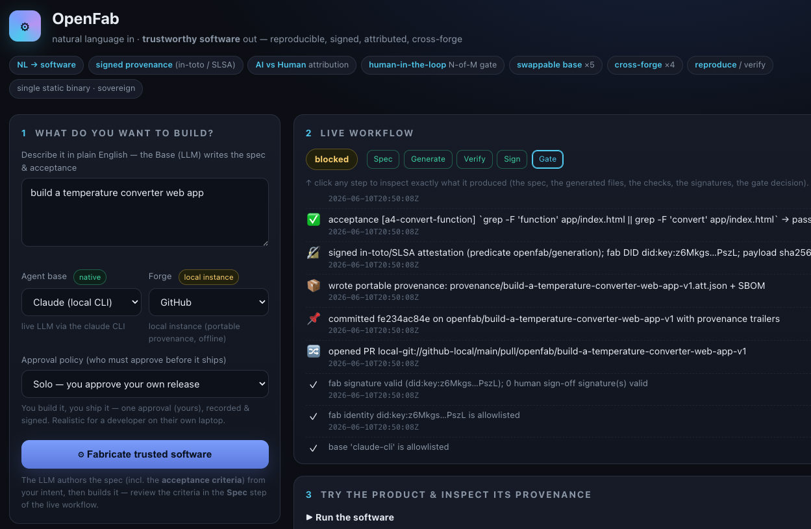

```bash
./init.sh                 # checks the toolchain
demo/run_web_demo.sh      # builds + launches the web UI → open http://127.0.0.1:8787
```

In the browser: type a **plain-English intent** → click **⚙ Fabricate** (the Base/LLM
authors the spec *and* its acceptance criteria from your intent, then builds it) → watch
the workflow stream live → the **trust gate blocks** → **▶ Run the app** (web apps open in
your browser; CLIs run in the sandbox) → approve (Solo/Team/Crowd) → the PR merges →
inspect signed **provenance** + the **Audit trail**, click **Reproduce & verify** →
**Refine** to iterate. The user supplies only the intent; everything else (spec,
acceptance, code) comes from the LLM. See [`docs/WEB.md`](docs/WEB.md).

**▶ Run the app** launches the generated software right there — e.g. this temperature
converter, fabricated from a one-line intent and running live in the browser:

<p align="center">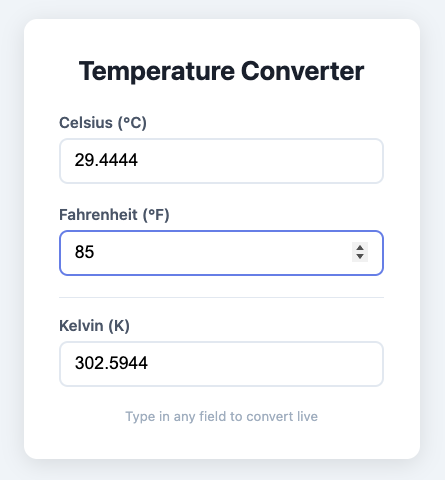</p>

## The CLI

```bash
# natural language in → the LLM authors the spec (incl. acceptance) → build it
openfab build "a CLI that converts temperatures between C, F and K with a --selftest flag" \
  --repo /tmp/myapp --base claude --gate solo

demo/run_demo.sh             # cross-forge + iteration over a saved spec (base=claude)
demo/run_selfhost_demo.sh    # OpenFab develops OpenFab — verified by cargo, signed, gated (PRD §6)
```

**Self-hosting (PRD §6):** `run_selfhost_demo.sh` clones OpenFab's own source and points
OpenFab at it to implement a change to *itself* — verified with the project's own
`cargo build` + `cargo test` in the sandbox, signed with provenance, and merged only after
N-of-M human sign-off. Every action is a signed git commit. See [`docs/SELF_HOSTING.md`](docs/SELF_HOSTING.md).

One run shows, end to end:

```
NL intent  →  spec (contract)  →  dispatch to base  →  app written
           →  machine acceptance in a sandbox
           →  signed in-toto/SLSA attestation (+ SBOM) with AI/Human attribution
           →  portable provenance committed in-repo  →  PR opened
           →  TRUST GATE blocks merge until N-of-M human sign-off
           →  maintainers sign off  →  gate opens  →  PR merges
           →  openfab verify  →  re-checks signatures + acceptance + sign-off
           →  same flow on a second forge  →  feedback bumps the spec (v→v+1)
```

---

## What you get (value propositions → where to see them)

| Proposition | Where it shows up |
|---|---|
| **NL → software** | `specs/*.spec.yaml` `intent:` becomes a working app under `app/` |
| **Trustworthy** | every product carries a signed in-toto/SLSA attestation (`provenance/*.att.json`) |
| **AI vs Human attribution** | the `openfab/generation` predicate records agent DID, model, prompt hash, file/line ranges + `author: ai/human` |
| **Reproducible (verify)** | `openfab verify` re-runs the contract: signatures + recorded acceptance + sign-off |
| **Human-in-the-loop** | the trust gate **blocks merge** until N-of-M maintainers sign off |
| **Neutral / cross-forge** | identical flow on two independent forges; provenance is plain JSON committed in-repo |
| **Swappable base** | `--base claude` or `codex` (local CLIs) or any framework base (`agentscope`/`hiclaw`/`agent-chat`/`openhands`) — same Core pipeline |
| **Spec cycle / iterative** | `openfab feedback` folds human NL into spec v→v+1 and re-runs |
| **Decision memory** | per-run human-readable timeline/audit trail (`.openfab/runs/<id>/timeline.md`) |

Full mapping with commands: [`docs/VALUE_PROPS.md`](docs/VALUE_PROPS.md).

---

## The trust story, panel by panel

Click any step in the **Live workflow** to inspect exactly what it produced. Each panel is
one value proposition made concrete — the same artifacts a third party can verify without
OpenFab.

### Spec — natural language becomes a machine-checkable contract
The Base (LLM) authors a versioned spec **and** its acceptance criteria (`a1`, `a2`, …)
from your bare intent. This exact spec is dispatched to the base and committed with the run.

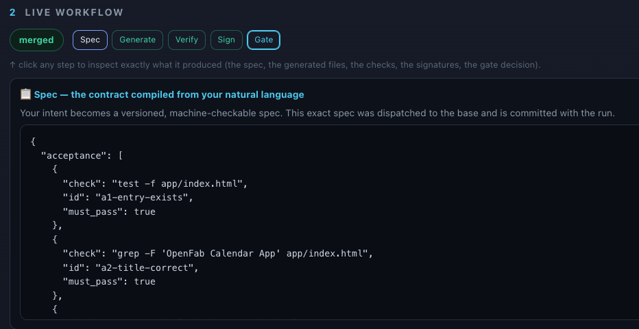

### Generate — identity & AI/Human attribution
Records the agent **DID**, base · model, runtime, and the **prompt SHA-256**, with every
changed file pinned by digest and tagged `author: ai | human`.

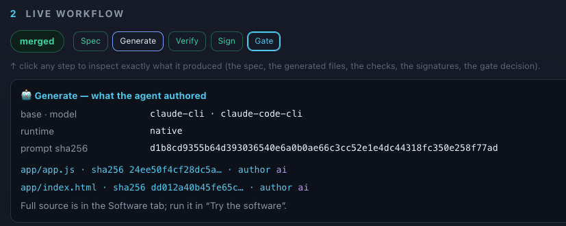

### Verify — reproducibility
"Acceptance" is the machine-checkable definition of done: each criterion is a shell command
that must exit 0, **re-run in the policy-gated sandbox** — by anyone, anytime.

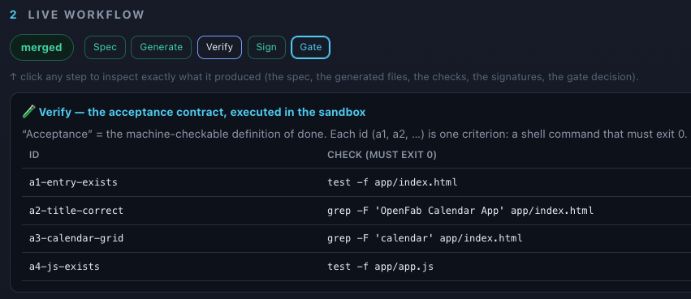

### Sign — signed provenance (in-toto / SLSA)
An in-toto/SLSA attestation, signed (ed25519 over canonical JSON) by the fab's `did:key`,
with a `payload_sha256` tamper-pin and a distinct `did:key` per human sign-off.

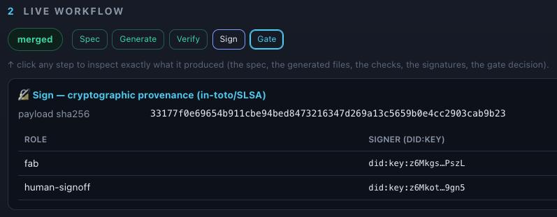

### Gate — attestation & auditability
The trust decision that **blocks merge until satisfied**: 11 conformance checks (C1–C11)
over statement type, predicate, attribution, signatures, sign-off, and machine acceptance.

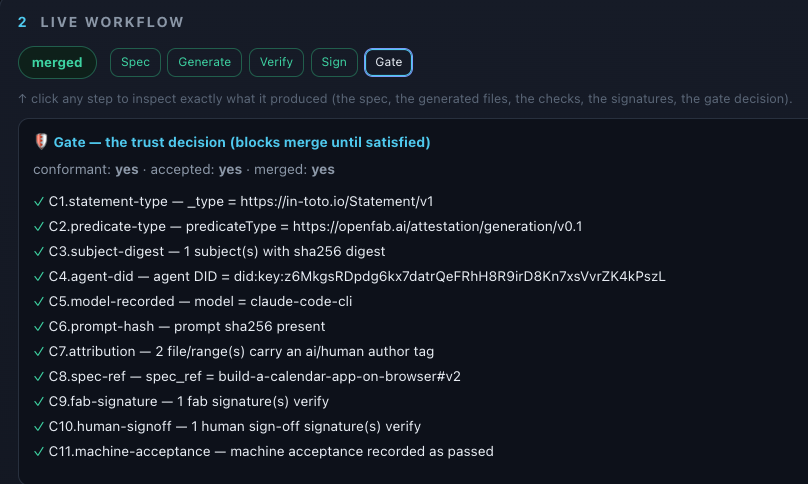

Once it ships, the same artifacts are browsable on the product — and **re-verifiable by
anyone, on any forge, without OpenFab.**

### Provenance — the signed attestation, in full
The complete `openfab/generation` predicate: predicate type, agent **DID**, base · model,
prompt SHA-256, acceptance result, payload SHA-256, every signature, per-file **ai/human**
attribution, and the human sign-offs — with the raw attestation JSON one click away.

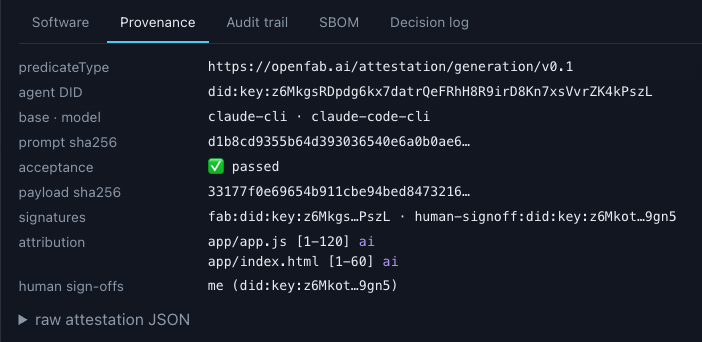

### Audit trail — auditability (EU CRA / SLSA)
Every action — the AI's authorship and each human sign-off — is a **signed git commit
carrying in-toto/SLSA provenance trailers**, the merge gated on N-of-M. The trail is plain
git + JSON committed in-repo, so third-party tools on any forge can verify it.

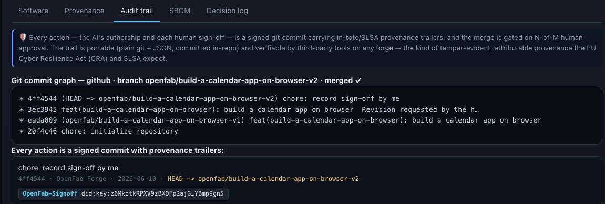

### SBOM — supply chain
An SPDX software bill of materials for the product, each file pinned by SHA-256.

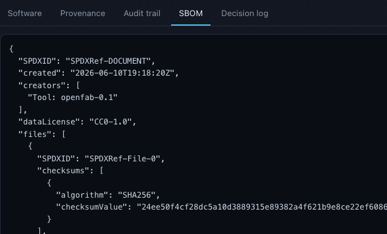

### Decision log — decision memory
The human-readable timeline of the whole run — intent, LLM-authored spec, recorded
assumptions and open questions, sandboxed acceptance, signing, and the gate — the durable
asset the fab produces.

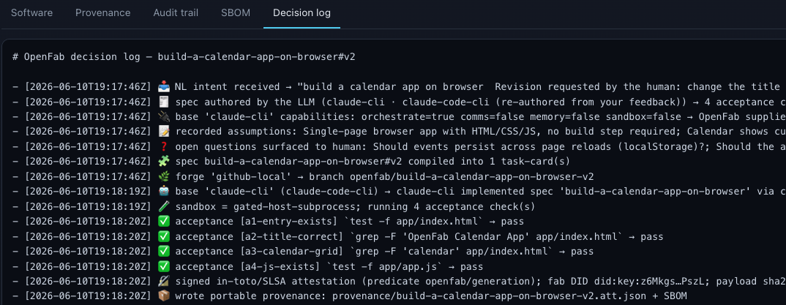

### Reproduce & verify — the sovereign proof
"Trust nothing, verify everything." Re-verifies the signature, confirms the committed
source is **bit-identical** to the signed digests, and **re-runs every acceptance check**
in the sandbox — one verdict.


### Maintainers & reputation — human-in-the-loop, and standing that compounds
The trust gate releases only on **N-of-M sign-off** from a pre-approved **maintainer
allowlist** (each a `did:key`). **Reputation** is a pure projection over the signed
attestations — authored / accepted / sign-offs per DID — so standing is *earned from
verifiable work*, not asserted in a separate database.

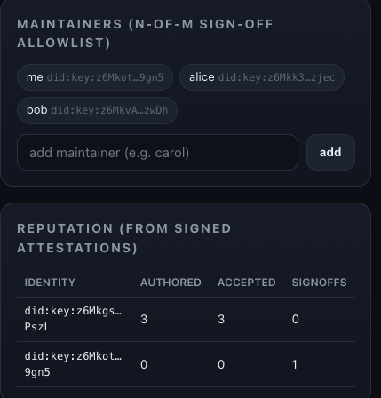

---

## Architecture

Two orthogonal pluggable axes around a stable Core (PRD §3):


- **Core (the moat, base/forge-independent):** `src/core/` — `spec` · `identity`
  (did:key) · `provenance` (in-toto/SLSA + `openfab/generation`) · `sbom` · `trust`
  (gate) · `reputation` · `conformance`.
- **Ports (the seams):** `src/ports/` — `BasePort` (swappable agent base) and
  `ForgePort` (swappable git host). Core only ever talks to these traits.
- **Adapters:** `src/adapters/` — bases: `base_claude` (live LLM via the `claude` or `codex` CLI) ·
  `base_framework` (AgentScope · HiClaw · agent-chat · OpenHands, native-if-configured
  else **bridged** through `llm_backend`). forges:
  `forge_local_git` · `forge_github` (gated) · `forge_rest` (Forgejo/Gitea/GitCode,
  gated). `registry` is the single construction + status surface; `sandbox` is supplied
  when a base lacks one.
- **Engine, ops, fronts:** `src/spec_cycle.rs` (PRD's `loop.rs`) → `src/ops.rs` (shared
  actions) → `src/cli.rs` + `src/server.rs` (web UI/API). One orchestration code path.

**Bases (6):** `claude` (native CLI), `codex` (native CLI), `agentscope`, `hiclaw`, `agent-chat`, `openhands`
(native if their `OPENFAB_*_URL` is set, else **bridged** via the LLM backend — the run
badges itself honestly). **Forges (4):** `github`, `forgejo`,
`gitea`, `gitcode` (live if `OPENFAB_*` creds are set, else an offline **local instance**
that still proves portable provenance). The LLM backend is the `claude` CLI by default,
or Qwen/DashScope with `OPENFAB_LLM=dashscope`.

```
openfab serve    --repo <dir> [--port 8787]          # the web UI + JSON API
openfab run      --spec <yaml> --repo <dir> [--base <id>] [--forge github|forgejo|gitea|gitcode]
openfab signoff  --repo <dir> --run <id> --as <maintainer>
openfab verify   --repo <dir> --run <id>
openfab feedback --repo <dir> --run <id> --note "<nl>" [--add-check "id=..,check=.."]
openfab maintainer-add --repo <dir> --name <name>
openfab reputation / list --repo <dir>
```

---

## Build & test

```bash
cargo build --release
cargo fmt --all && cargo clippy --all-targets --all-features -- -D warnings && cargo test
```

## Honest scope of v0.1 (what is real vs. the documented production swap)

OpenFab's value is the *integrated whole*; v0.1 deliberately implements the moat with
the **smallest dependency set that satisfies the spec** (AGENTS.md), and shells out to
CLIs. Each lighter choice names its production-grade swap so nothing is overstated:

| v0.1 (this build) | Production swap (documented) |
|---|---|
| did:key + ed25519 signing, offline-verifiable | Sigstore (cosign / fulcio / rekor transparency log) |
| in-process trust evaluator reads `policy/trust.json` | OPA / `regorus` over `policy/trust.rego` |
| policy-gated host subprocess sandbox | Podman / gVisor container |
| SPDX-lite SBOM emitted directly | Syft (SPDX / CycloneDX) |
| two local-git forges prove portability; GitHub adapter real-but-gated | GitHub + Forgejo + Gitea live |
| acceptance re-run = reproducibility | Nix flakes for bit-identical builds (v0.2) |

See [`docs/adr/0001-mvp-architecture-decisions.md`](docs/adr/0001-mvp-architecture-decisions.md)
for why, and [`HANDOFF.md`](docs/HANDOFF.md) for done / next / open questions.

License: Apache-2.0 · Governance: AOSF (aosf.ai) · Implements: SLSA · in-toto · Sigstore · DID.
