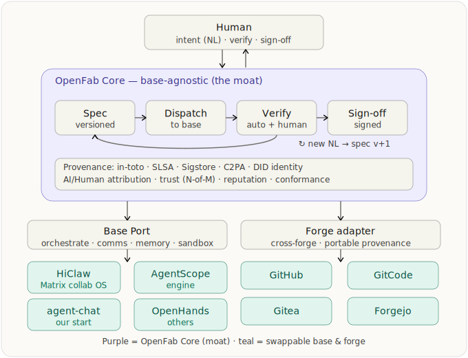

# OpenFab — MVP Design & PRD

**Status:** v0.2 implemented (this repo) · **License:** Apache-2.0 · **Governance:** AOSF (aosf.ai) — neutral foundation
**Site:** open-fab.ai · **Implements:** SLSA · in-toto · Sigstore · C2PA · DID

This document captures OpenFab's architecture decisions and its recursive (self-building) development method, and doubles as the product spec (PRD) for the MVP. It is the **design intent / north star**; for exactly what ships today and where each production-grade component is still a documented swap, see **§0 Implementation status** immediately below (and [`README.md`](../README.md), [ADR 0001](adr/0001-mvp-architecture-decisions.md), [ADR 0002](adr/0002-web-ui-and-base-forge-matrix.md)). Keep it short; detail lives in code and specs.

---

## 0. Implementation status — what ships today (v0.2)

The repository implements this PRD through **v0.1** (the hand-built Core + CLI engine) and **v0.2** (a built-in web UI + the full base/forge matrix). The table maps each planned choice to what is actually built, so the document stays honest about the gap (R14). Every lighter choice names its production swap; nothing is faked or overstated. `cargo fmt` + `clippy -D warnings` + **41 tests** are green.

| Area | PRD intent (production target) | Built today (v0.2) |
|---|---|---|
| Language | Rust, single static binary | ✅ Rust 2021; `lib` + thin `bin` split |
| NL → spec | a spec is derived from the NL ask | ✅ the **Base (LLM) authors the spec *and* its acceptance criteria** from the bare intent — **no mock, no template, no hardcoded app** |
| Agent base | AgentScope + HiClaw, swappable | ✅ **5 bases** behind `BasePort`: `claude` (native) + `agentscope`/`hiclaw`/`agent-chat`/`openhands` (one `base_framework` adapter — **native** if its `OPENFAB_*_URL` is set, else **bridged** through the LLM backend, badged honestly) |
| Forge | GitHub + Forgejo + Gitea (+ GitCode) | ✅ **4 forges** behind `ForgePort` (`forge_github` via `gh`; `forge_rest` for the Gitea-lineage three) — **live** if creds set, else an offline **local instance** that still proves portable in-repo provenance |
| Identity / signing | Sigstore (cosign / fulcio / rekor) | did:key + ed25519, offline-verifiable — **swap:** Sigstore |
| Provenance | in-toto + SLSA + `openfab/generation` predicate | ✅ in-toto Statement v1 + the custom `openfab/generation` predicate, DSSE-style signed over canonical JSON |
| SBOM | Syft (SPDX / CycloneDX) | SPDX-lite emitted directly — **swap:** Syft |
| Trust policy | OPA / Rego | in-process evaluator over `policy/trust.json`; `policy/trust.rego` ships as the illustrative form — **swap:** regorus |
| Gate | N-of-M human sign-off | ✅ configurable gate — **solo / team / crowd / none** — versioned, never hot-loaded, never self-approved |
| Sandbox | Podman / gVisor | policy-gated host subprocess (timeout + process-group kill) — **swap:** Podman / gVisor |
| Reproducible | Nix bit-identical builds | acceptance re-run + signature verify + source-hash — **swap:** Nix flakes |
| Human-in-the-loop UI | the base's Matrix UI (custom UI was a v0.1 non-goal) | ✅ a built-in **web UI** (`openfab serve`), added in v0.2: NL → live workflow → **Run the app** → approve / refine → provenance / audit trail → reproduce |
| Recursive / self-hosting | OpenFab builds OpenFab | ✅ demonstrated (`demo/run_selfhost_demo.sh`): a change to OpenFab itself, verified by the project's own `cargo build`/`test`, signed, gated |

---

## 1. What OpenFab is

**OpenFab is a fab** — an open-source software factory: natural language in, software products out. It is the first fab built on **open standards** (SLSA / in-toto / Sigstore / C2PA / DID) that makes its end products **reproducible · trustworthy · open · neutral · cross-forge**, running on a **swappable agent base** under neutral **AOSF** governance.

OpenFab *composes* existing primitives (orchestrators, signing, provenance, identity) rather than reinventing them — but the **integrated whole is novel and unique**: no existing software delivers an open, neutral, cross-forge fab whose every output carries a reproducible build + signed provenance + AI/Human attribution. The fab is the product; the adjectives (reproducible · trustworthy · open · neutral · cross-forge) are what it *guarantees about everything it makes*. Artifacts (code) are cheap; the durable asset the fab produces is the **process + decision memory + signed provenance**.

---

## 2. Design principles

1. **Reuse, don't reinvent the primitives.** Implement OpenFab as thin glue + a profile/conformance spec over mature OSS + standards. The novelty is the integrated *whole* (the fab), not the building blocks.
2. **Base-agnostic (ports & adapters).** The agent runtime/collaboration "base" is swappable (HiClaw, AgentScope, agent-chat, OpenHands) behind a thin **Base Port**. No lock-in to any one.
3. **Forge-agnostic.** The git host is swappable (GitHub, GitCode, Gitea, Forgejo) behind a **Forge adapter**. Provenance is forge-neutral and portable.
4. **OpenFab Core is the moat, and base-independent.** Spec, provenance, identity, trust, reputation, conformance live here — identical regardless of base or forge.
5. **Reproducible = build + verification, not generation.** Freeze source → bit-identical build (later via Nix) + re-runnable acceptance + signed provenance. The LLM step is *recorded* (the AI is the author), not replayed.
6. **Human-in-the-loop, spec-driven, iterative.** See §4.
7. **Engineering discipline.** Sound software engineering throughout — modular architecture, clear interfaces, reuse-first, simple, plug-and-play (the ports/adapters are the plug-and-play surface). Always prefer the simplest design that satisfies the spec.

---

## 3. Architecture



Two orthogonal pluggable axes (Base down, Forge across) around a stable Core. NL intent and all human feedback enter through the **base's comms channel** — when the base is HiClaw, that is the **Matrix UI (Element)**, and the Matrix room timeline doubles as the human-readable decision log + audit trail.

**Base Port** (the key abstraction). Capability-negotiated; OpenFab fills gaps when a base lacks a capability (e.g. uses its own sandbox if the base has none).

```rust
pub trait BasePort {
    fn capabilities(&self) -> Capabilities;                 // orchestrate, comms, memory, sandbox
    // orchestration
    fn dispatch(&self, task: &TaskCard) -> Result<RunHandle>;
    fn result(&self, h: &RunHandle) -> Result<RunResult>;
    // comms -- human-in-the-loop (Matrix when base = HiClaw)
    fn post(&self, channel: &str, msg: &str) -> Result<()>;
    fn events(&self, channel: &str) -> Result<EventStream>; // human NL feedback in
    // memory
    fn memory_get(&self, key: &str) -> Result<Option<Vec<u8>>>;
    fn memory_put(&self, key: &str, val: &[u8]) -> Result<()>;
    // sandbox
    fn run_sandboxed(&self, cmd: &[String], workdir: &Path) -> Result<ExecResult>;
}
```

### Enterprise agentd execution profile (proposed amendment)

**Ratification status:** proposed on 2026-07-12; not part of the implemented
v0.2 behavior until ADR 0003 is accepted and its conformance tests pass.

The enterprise profile preserves `BasePort` as OpenFab's swappable execution
seam while assigning durable execution ownership to agentd:

- OpenFab continues to own an invoked spec cycle, its verification request,
  provenance, trust policy result, certification state, and human gate.
- The agentd `BasePort` adapter translates `dispatch` into one immutable
  `ProjectExecutionSnapshot` plus a durable agentd run. It translates `result`
  into immutable execution-artifact and audit references.
- `AgentdControlPlane` owns run/task identity, queueing, leases, fencing,
  runtime-session records, checkpoints, artifact index, execution audit, and
  measured usage. OpenFab must not mirror these as a second mutable runtime
  state machine.
- `AgentdWorker` owns only disposable live process/PTY, workspace/cache, and
  unacknowledged upload-spool state.
- OpenFab certification never accepts a worker self-report as sufficient proof;
  it consumes immutable evidence references and can independently re-run
  project-policy-required checks.
- A direct Robrix-to-agentd profile is selected by project policy and bypasses
  OpenFab orchestration. It does not receive an OpenFab certification result
  unless a separate certification request is made.

OpenFab Core remains base-independent. Agentd identities, Matrix transport
types, worker protocols, and runtime implementation details stay in the
`BasePort` adapter or versioned evidence schemas. OpenFab stores the external
agentd run/evidence references needed to resume its own spec cycle, not agentd's
queue, lease, or process state.

**Forge adapter.**

```rust
pub trait ForgePort {
    fn clone_repo(&self, repo: &str, dest: &Path) -> Result<()>;
    fn branch(&self, name: &str) -> Result<()>;
    fn commit(&self, paths: &[PathBuf], msg: &str, trailers: &Trailers) -> Result<Sha>;
    fn open_pr(&self, title: &str, body: &str, head: &str, base: &str) -> Result<PrUrl>;
    fn write_provenance(&self, att: &Attestation) -> Result<()>;  // forge-neutral, committed in-repo
}
```

---

## 4. The spec cycle (workflow)

NL is ambiguous and specs are incomplete, so development is a **cycle**, not a line:

```
NL/PRD -> Spec v1 (records assumptions; surfaces open questions)
       -> Dispatch task-cards to base -> agents implement
       -> Verify: (1) machine: acceptance checks in sandbox  (2) human: intent gap
       -> Human feedback (new NL) -> Spec v+1 -> re-dispatch
       -> ... converge -> human sign-off (= signed attestation)
```

- **Dual verification:** machine acceptance (reproducible checks) + human intent check (catches spec gaps). The human half drives the next loop.
- **Ambiguity:** a reviewer step flags under-specified parts and asks clarifying questions back to the human (as NL); the spec records assumptions.
- **Every loop accrues provenance + decision memory** — that trail is the durable asset.
- **Termination:** human sign-off (N-of-M when required). Final state = artifact + full spec history + signed acceptance.

**Spec format.**

```yaml
id: openfab-feature-x
version: 1
intent: >                 # the natural-language ask
  ...
context: [files, links]
acceptance:               # machine-checkable, executable
  - id: a1
    check: "cargo test acceptance::x"   # any executable command; exit 0 = pass
    must_pass: true
assumptions: []           # filled in when the NL was ambiguous
open_questions: []        # surfaced to the human via comms
human_signoff_required: true
```

---

## 5. What's reused vs. what's new

| Concern | Reuse (OSS / standard) |
|---|---|
| Agent orchestration / base | AgentScope (engine) · HiClaw (Matrix collab) · agent-chat · OpenHands — via Base Port |
| Agent comms / human-in-loop | Matrix (HiClaw / Element) |
| Memory | AgentScope ReMe (file + vector) |
| Signing + transparency log | Sigstore: cosign · fulcio · rekor |
| Provenance / build attestation | in-toto + SLSA (slsa-verifier) |
| SBOM | Syft (SPDX / CycloneDX) |
| AI-content provenance | C2PA (c2patool) — v0.2 |
| Identity (DID) | did:key / did:web; Sigstore OIDC for humans |
| Spec acceptance | Gherkin / pytest; JSON Schema for the spec |
| Trust policy | OPA / Rego (allowlist + N-of-M) |
| Sandbox re-verification | gVisor / Podman container |
| Cross-forge | git + forge REST (GitHub, Forgejo, Gitea, GitCode) + ForgeFed |
| Reproducible build | Nix flakes — v0.2 |
| Reputation | derived from rekor / signed attestations |

**Genuinely new code (thin — the moat):**
1. Orchestration glue (the spec-cycle engine).
2. OpenFab profile / conformance spec **+ a custom in-toto predicate** `openfab/generation` (records agent DID, model, prompt hash, params, file/line ranges, spec ref → enables AI-vs-Human attribution + spec-as-contract).
3. Forge-agnostic adapter + portable provenance binding.

---

## 6. Recursive development methodology (bootstrap / self-hosting)

OpenFab is built to eventually **build itself** — like a self-hosting compiler. New capabilities are added *by OpenFab*, each with its own provenance.

| Phase | What | Built by |
|---|---|---|
| **0 — stage-0** | Hand-build the minimal Core, Base Port, one base + one forge adapter, spec engine, provenance, CLI | Humans + coding agents (it can't build itself yet) |
| **1 — self-hosting** | Add a 2nd forge (cross-forge proof) + Matrix comms; then **point OpenFab at its own repo** and implement the next feature *through OpenFab* | OpenFab (gated by humans) |
| **2 — recursive growth** | Every new capability (new adapter, predicate, policy, reputation, conformance) is specced and built by OpenFab, each with provenance | OpenFab |

**Two layers of self-development.** "Self-development" is the *process* above (spec-cycle + provenance + gates), applied at two layers that share the same process but **deploy differently**:

| Self-developed | How it deploys |
|---|---|
| **Core** (Rust machinery — orchestration, signing, provenance, trust gate, new adapters) | a new **signed binary version** → rebuild + zero-downtime swap (rolling / `exec` self-replace); in-flight specs resume from persisted state; the base's comms/room (e.g. HiClaw/Matrix) stays up across the swap |
| **Extensions** (WASM plugins · Rego policy · specs · skills) | **hot-loaded at runtime** (signed + sandboxed), no restart |

Most capability *growth* can take the extension path (hot, sandboxed); evolving the trusted machinery takes the core path (versioned, signed). It is **not** "self-development only via WASM" — both are real; the WASM/plugin plane is just the hot, sandboxed slice. In **v0.1 / Phase 1**, self-development means **core changes via rebuild + swap**; the plugin plane is a later phase (a v0.1 non-goal).

**Guardrails (critical).** Self-generated changes must pass OpenFab's *own* trust model:
(1) machine acceptance (spec tests in sandbox) → (2) **human sign-off / N-of-M** (maintainers approve OpenFab's changes to itself) → (3) signed provenance + reputation.
**Humans stay in the loop; no unattended self-rewrite.** The same trust layer that guards untrusted crowd contributions guards the system's self-modification. The single most sensitive component is the **trust gate / signing core itself** (the code that decides whether to accept a change): it may be self-developed, but only under the strictest human / N-of-M control — **always versioned, never hot-loaded, never self-approved**. OpenFab cannot autonomously weaken its own gate.

**Payoff.** Strongest possible credibility (OpenFab's own provenance trail is the reference showcase); every capability auditable; the spec-cycle and trust model are stress-tested on a real, complex codebase — its own. OpenFab is its own first user.

---

## 7. PRD — MVP v0.1 (build this first)

**Goal (one sentence).** On a self-hosted Forgejo *and* GitHub, `openfab run <spec>` dispatches a coding agent to implement a spec'd task, verifies acceptance in a sandbox, emits a signed in-toto/SLSA attestation + SBOM (with agent DID + AI/Human attribution), commits portable provenance, opens a PR, and requires human sign-off — with identical behavior on both forges.

**Stack (decided).** **Rust** (stable, edition 2021) for Core + CLI; shell out to language-agnostic CLIs (`cosign`, `syft`, `slsa-verifier`) and to the agent base. Rationale: OpenFab is a security/provenance tool meant to be **self-hosted and air-gapped**, so a single static binary (no runtime) fits the sovereign value-prop; the Rust ecosystem covers the moat natively — `sigstore` (signing/verify), `c2pa` (C2PA reference impl is Rust), `didkit`/`ssi` (did:key), `regorus` (in-process Rego), `git2`, `reqwest`+`serde`, `clap`. The base is reached through the Base Port, which is a cross-process boundary anyway (bases are polyglot — AgentScope is Python, HiClaw/agent-chat are Node), so Core's language is not tied to any base. in-toto/SLSA attestations are signed JSON, emitted via `serde` + `sigstore` (and verified with `slsa-verifier`/`cosign`), so no heavy in-toto library is required. (Trade-off vs Python: slightly slower MVP iteration; accepted for the distribution + safety posture.)

**v0.1 reference picks.** base = **AgentScope** (orchestration/memory/sandbox) + **HiClaw** (Matrix comms, human-in-loop), swappable to **agent-chat** (our own software) or OpenHands; forges = **GitHub + Forgejo + Gitea** (Forgejo & Gitea share API lineage, so one adapter pattern covers both); identity = **did:key** (+ Sigstore OIDC for humans); policy = **OPA/Rego**; sandbox = **Podman/gVisor**.

### Repo layout
```
openfab/
  Cargo.toml   rust-toolchain.toml
  README.md    OpenFab_MVP_Design_and_PRD.md   AGENTS.md   init.sh   (harness)
  src/
    main.rs    cli.rs    loop.rs                # CLI entry + spec-cycle engine
    core/      mod.rs spec.rs provenance.rs identity.rs trust.rs reputation.rs conformance.rs
    ports/     mod.rs base.rs forge.rs
    adapters/  mod.rs base_agentscope.rs base_hiclaw_matrix.rs base_agentchat.rs
               forge_github.rs forge_forgejo.rs forge_gitea.rs
  specs/   openfab-v0.1.spec.yaml      # the spec for OpenFab itself (bootstrap)
  schemas/ spec.schema.json  openfab-generation.predicate.json
  policy/  trust.rego
  tests/
```

### Build order (= Phase 0 milestones)
1. Scaffold the Cargo workspace (`Cargo.toml`, `rust-toolchain.toml`) + module layout; define the `BasePort` / `ForgePort` **traits** and core structs (`TaskCard`, `Spec`, `Attestation`, `RunResult`); stub adapters so it compiles.
2. `core/spec.rs`: parse + validate (JSON Schema) + version specs; compile a spec → task-cards; run acceptance checks.
3. `adapters/base_agentscope.rs`: dispatch a coding task, return artifacts; implement `run_sandboxed`.
4. `adapters/forge_github.rs`: clone / branch / commit (with trailers) / open PR; `write_provenance`.
5. `core/identity.rs` (did:key via `didkit`/`ssi`) + `core/provenance.rs`: build the in-toto/SLSA attestation with the `openfab/generation` predicate; sign with `sigstore` (cosign-compatible); log to Rekor; SBOM via `syft`.
6. `core/trust.rs`: signature verify + Rego policy via `regorus` (allowlist + N-of-M) + human sign-off gate.
7. `loop.rs` + `cli.rs`: wire the full spec cycle; `openfab run <spec> --repo <url>`.

### v0.1 Definition of Done (acceptance)
- `openfab run specs/demo.spec.yaml --repo <github|forgejo>` completes the full cycle and opens a PR.
- The PR carries a **signed** in-toto/SLSA attestation + SBOM; `openfab verify` (cosign + slsa-verifier) passes.
- The attestation records agent **DID**, model, prompt hash, and changed file/line ranges (AI-vs-Human attribution).
- Acceptance checks run in a **sandbox**; merge is **blocked** until human sign-off (N-of-M policy).
- **Same flow + verification works across GitHub, Forgejo, and Gitea**; provenance is portable (forge-neutral files committed in-repo).
- Human feedback via the comms channel updates the spec (v → v+1) and re-runs the loop.

### Non-goals (v0.1)
Open Token / monetary settlement · public hosted instance · full federation · Nix bit-identical reproducibility · custom UI (use the base's Matrix UI) · C2PA · model fine-tuning · WASM/plugin hot-load plane (later phase — v0.1 self-development is core via rebuild + swap) · reputation beyond a basic attestation-derived stat.

### Decisions & notes
- **Core language:** Rust (decided) — single static binary for air-gapped/sovereign deploys; native `sigstore` / `c2pa` / `didkit` / `regorus`.
- **Base is swappable, so no single base's license can block the project.** agent-chat is our own software and a first-class base option — we license it (Apache-2.0) when we adopt it. Any external base (AgentScope, HiClaw, OpenHands) is used only through the Base Port and can be replaced.
- **Forges in scope:** GitHub + Forgejo + Gitea (Forgejo/Gitea share API lineage); GitCode and ForgeFed federation later.

### Milestones
- **M0 (Phase 0):** build order 1–7; single base (AgentScope) + single forge (GitHub) + human sign-off; repo set up as a harness (§8).
- **M1 (Phase 1, self-hosting):** add Forgejo + Gitea adapters (cross-forge proof across three) + HiClaw/Matrix comms; then build the next feature (e.g. `core/reputation.rs`) *through OpenFab* on OpenFab's own repo.
- **M2 (Phase 2, recursive):** new capabilities (GitCode adapter, C2PA, conformance profile, federation) specced + built by OpenFab, gated by its trust model.

## 8. Development harness (building OpenFab with agents)

Phase 0–2 are built largely *by* coding agents, so the OpenFab repo must itself be a well-engineered **harness** — the environment-shaping that turns the same model from unreliable to reliable. Adopt these practices (vendor-neutral; drawn from OpenAI's and Anthropic's harness field reports) from day one:

- **Repo-local agent instructions** — an `AGENTS.md` (+ `CLAUDE.md`) at the root: how to build, test, the conventions, and the boundaries an agent must respect.
- **Deterministic session lifecycle** — an `init.sh` that brings up a clean, reproducible env at session start with a clean teardown/restart path; no hidden state between sessions.
- **Feature list as the work queue** — the build order (§7) *is* the agent feature list; each item carries executable acceptance.
- **Verify-on-edit (highest-impact pattern)** — after every edit, auto-run lint / typecheck / the relevant tests and feed results back into the agent's context; gate the same checks in CI.
- **Self-verification + evaluators** — acceptance checks are the contract; add an evaluator step that judges agent output against intent.
- **Handoff artifacts** — persist task state + decisions across context windows so long-running work survives context limits.
- **Safe autonomy** — sandboxed execution + command/path allow-deny rules + the human / N-of-M sign-off gate before merge.
- **Telemetry** — record what agents did (feeds provenance).

These harness primitives are the *same* ones OpenFab formalizes in Core: feature list ≈ spec-as-contract · verify-on-edit + evaluators ≈ dual verification · sandbox + sign-off ≈ trust model · handoff + telemetry ≈ decision-memory + provenance. So the Phase-0 hand-built harness is the **seed of OpenFab's own spec-cycle** — by Phase 1, OpenFab's cycle subsumes it. Draw on existing harness conventions/tooling (`AGENTS.md`, OpenHarness-style runtimes, awesome-harness-engineering) rather than reinventing; note that the agent base (AgentScope / HiClaw / OpenHands / agent-chat) already supplies several harness pieces (memory, sandbox, skills) through the Base Port.

---

*Implements: SLSA · in-toto · Sigstore · C2PA · DID. Governance: AOSF (aosf.ai). License: Apache-2.0.*
